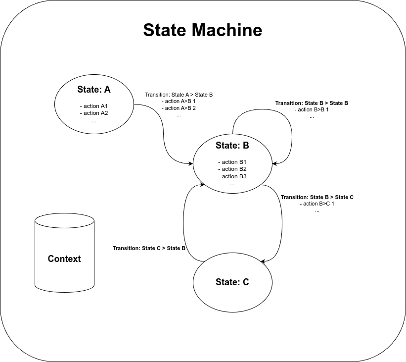
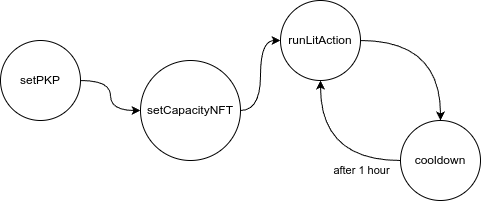
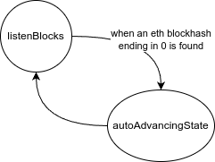
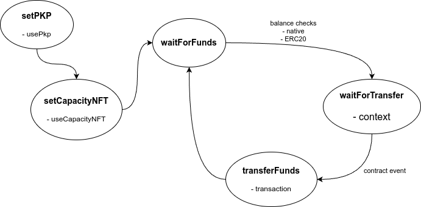

# @lit-protocol/event-listener

A TypeScript library for creating and managing automated workflows using Lit Protocol.

The event listener package provides a flexible state machine implementation that allows you to:

- Execute automated Lit Action workflows based on custom triggers, such as events on blockchains or off-chain platforms
- Automate the minting of PKPs, Capacity Credits, and other Lit operations
- Monitor token balances and price info
- Perform cross-chain messaging and transaction execution
- And more...

## Installation

```bash
npm install @lit-protocol/event-listener
# or
yarn add @lit-protocol/event-listener
```

## Core Concepts



### State Machine

A state machine consists of states, and transitions between those states which are triggered based on a collection of Listeners.

### Actions

Actions are the different tasks the state machine will do. Each action can:

- Execute code when entered and/or exited
- Configure PKPs and Capacity Credits for the machine
- Run Lit Actions
- Send blockchain transactions
- Run custom code

### States

States represent different states the machine will stand and move between. Each state can have an array of Actions to perform when entering or exiting itself.

### Transitions

Transitions define how the machine moves between states. They can be triggered automatically or by any combination of:

- Blockchain events
- Token balance changes
- Timers and intervals
- HTTP requests (polling)
- Custom conditions

When a Transition gets new values, it uses its `check` function to determine if the values are a match or not.

Depending on the `check` result, it calls the `onMatch` or `onMismatch` function. Also, when there is a match, it can trigger actions and move the state machine to the next state.

### Listeners

Listeners monitor various events and feed data to transitions:

- EVMBlockListener: Monitors new blocks
- EVMContractEventListener: Monitors EVM smart contract events
- TimerListener: Triggers based on time
- FetchListener: Polls an HTTP endpoint at regular intervals
- IntervalListener: Runs a function at regular intervals

## Basic Example

Here's a simple example that mints a PKP, a Capacity Delegation NFT and then runs a Lit Action every hour:



```typescript
async function runLitActionInterval() {
  const stateMachine = StateMachine.fromDefinition({
    privateKey: '0xPRIVATE_KEY_WITH_LIT_TOKENS',
    litNodeClient: {
      litNetwork: 'datil-test',
    },
    litContracts: {
      network: 'datil-test',
    },
    states: [
      {
        key: 'setPKP',
        actions: [
          {
            key: 'usePkp',
            mint: true,
          },
        ],
        transitions: [{ toState: 'setCapacityNFT' }],
      },
      {
        key: 'setCapacityNFT',
        actions: [
          {
            key: 'useCapacityNFT',
            mint: true,
            daysUntilUTCMidnightExpiration: 10,
            requestPerSecond: 1,
          },
        ],
        transitions: [{ toState: 'runLitAction' }],
      },
      {
        key: 'runLitAction',
        actions: [
          {
            key: 'litAction',
            code: `(async () => {
              if (magicNumber >= 42) {
                  LitActions.setResponse({ response:"The number is greater than or equal to 42!" });
              } else {
                  LitActions.setResponse({ response: "The number is less than 42!" });
              }
            })();`,
            jsParams: {
              magicNumber: Math.floor(Math.random() * 100),
            },
          },
        ],
        transitions: [{ toState: 'cooldown' }],
      },
      {
        key: 'cooldown',
        transitions: [
          {
            toState: 'runLitAction',
            timer: {
              // One hour, checking every second
              interval: 1000, // one second
              until: 1 * 60 * 60, // 3600 times
            },
          },
        ],
      },
    ],
  });

  // Start the machine at the desired state
  await stateMachine.startMachine('setPKP');
}

runLitActionInterval().catch(console.error);
```

## Functional interface

There care cases where such a declarative interface won't be enough for your use case. When that happens, the machines can also accept generic states, actions, transitions and listeners where it is possible to write any logic.

Here is an example that listens to Ethereum block hashes, looking for those that end in '0'



```typescript
async function monitorEthereumBlocksWithHashEndingWithZero() {
  const litNodeClient = new LitNodeClient({
    litNetwork: 'datil-dev',
  });
  const litContracts = new LitContracts({
    network: 'datil-dev',
  });
  const stateMachine = new StateMachine({
    // When the machine doesn't mint nor use Lit, these values do not matter
    privateKey: 'NOT_USED',
    litNodeClient,
    litContracts,
  });
  // const stateMachine = StateMachine.fromDefinition({...}) also works to extend a base definition

  // Add each state individually
  stateMachine.addState({
    key: 'listenBlocks',
    onEnter: async () =>
      console.log('Waiting for a block with a hash ending in 0'),
    onExit: async () => console.log('Found a block whose hash ends in 0!'),
  });
  stateMachine.addState({
    key: 'autoAdvancingState',
  });

  // Then add transitions between states
  stateMachine.addTransition({
    // Because this transition does not have any listeners, it will be triggered automatically when the machine enters fromState
    fromState: 'autoAdvancingState',
    toState: 'listenBlocks',
  });
  stateMachine.addTransition({
    fromState: 'listenBlocks',
    toState: 'autoAdvancingState',
    // listeners are the ones that will produce the values that the transition will monitor
    listeners: [new EVMBlockListener(LIT_EVM_CHAINS.ethereum.rpcUrls[0])],
    // check is the function that will evaluate all values produced by listeners and define if there is a match or not
    check: async (values): Promise<boolean> => {
      // values are the results of all listeners
      const blockData = values[0] as BlockData;
      if (!blockData) return false;
      console.log(`New block: ${blockData.number} (${blockData.hash})`);
      return blockData.hash.endsWith('0');
    },
    // when check finds a match (returns true) this function gets executed and the machine moves to toState
    onMatch: async (values) => {
      // values are the results of all listeners
      console.log('We have matching values here');
    },
    onMismatch: undefined, // when check returns false (there is a mismatch) this function gets executed but the machine does not change state
    onError: undefined,
  });

  await stateMachine.startMachine('listenBlocks');
}
monitorEthereumBlocksWithHashEndingWithZero().catch(console.error);
```

Last machine could have been implemented with just the `listenBlocks` state and a `listenBlocks` -> `listenBlocks` transition, but the machine realizes that the state does not change and therefore does not exit nor enter the state, however it runs the transition `onMatch` function.

## Context

Each State Machine has its own information repository called `context`.

When using the defined states in the declarative interface, some values are already populated and then used later

- `usePkp` action populates `context.activePkp` with the minted PKP data
- `useCapacityNFT` action populates `context.activeCapacityTokenId` with the minted Capacity Token Id
- `litAction` action populates `context.lastLitActionResponse` with the lit action response
- `transaction` action populates `context.lastTransactionReceipt` with the transaction receipt

When executing a `litAction` or `transaction` action, the `context` must have `activePkp` and `activeCapacityTokenId` (if needed) populated.

Several places in the machine definition can read values from the context. Instead of passing a literal value, pass an object with the `contextPath` property, like in the following example.

The machine context can be manually accessed using its `getFromContext`, `setToContext` or `pushToContext` methods to read or write.

### Advance example

By leveraging context from the State Machine in combination with Lit PKPs, it is possible to implement a cross-chain messaging service that can be used to read and write data across virtually any blockchain.

In this example, when a State Machine PKP receives USDC in Base Sepolia, it will send the same amount to the sender but in Ethereum Sepolia.



```typescript
async function bridgeBaseSepoliaUSDCToEthereumSepolia() {
  const evmSourceNetwork = LIT_EVM_CHAINS.baseSepolia;
  const evmDestinationNetwork = LIT_EVM_CHAINS.sepolia;
  const pkp = {
    tokenId: '0x123...',
    publicKey: '456...',
    ethAddress: '0x789...',
  } as PKPInfo; // Minted Previously
  const capacityTokenId = '123456'; // Minted previously
  // Because the pkp and the capacity token nft were minted previously, this private key only needs to be an authorized signer of the pkp. It can be empty, without funds of any kind
  const ethPrivateKey = '0xTHE_PKP_AUTHORIZED_SIGNER_PRIVATE_KEY';

  const stateMachine = StateMachine.fromDefinition({
    privateKey: ethPrivateKey, // Used only for authorization here, minting was done previously
    context: {
      // We can prepopulate the context, for example setting the pkp here instead of using state.usePkp later
      // activePkp: pkp,
    },
    litNodeClient: {
      litNetwork: 'datil',
    },
    litContracts: {
      network: 'datil',
    },
    states: [
      {
        key: 'setPKP',
        actions: [
          {
            key: 'usePkp',
            pkp, // Configure the pkp passed. Not minting a new one
          },
        ],
        transitions: [{ toState: 'setCapacityNFT' }],
      },
      {
        key: 'setCapacityNFT',
        actions: [
          {
            key: 'useCapacityNFT',
            capacityTokenId: capacityTokenId, // Configure the capacity token to use. Not minting a new one
          },
        ],
        transitions: [{ toState: 'waitForFunds' }],
      },
      {
        key: 'waitForFunds',
        // Waits for our emitting PKP to have some USDC and native balance in destination chain
        transitions: [
          {
            toState: 'waitForTransfer',
            balances: [
              {
                address: pkp.ethAddress as Address,
                evmChainId: evmDestinationNetwork.chainId,
                type: 'native' as const,
                comparator: '>=' as const,
                amount: '0.001',
              },
              {
                address: pkp.ethAddress as Address,
                evmChainId: evmDestinationNetwork.chainId,
                type: 'ERC20' as const,
                tokenAddress: USDC_ETH_SEPOLIA_ADDRESS,
                tokenDecimals: 6,
                comparator: '>=' as const,
                amount: '20',
              },
            ],
          },
        ],
      },
      {
        key: 'waitForTransfer',
        actions: [
          {
            key: 'context',
            log: {
              path: '', // We want to log the full context for debugging
            },
          },
        ],
        transitions: [
          // Waits to receive an USDC transfer in our listening chain
          {
            toState: 'transferFunds',
            evmContractEvent: {
              evmChainId: evmSourceNetwork.chainId,
              contractAddress: USDC_BASE_SEPOLIA_ADDRESS,
              contractABI: USDC_ABI,
              eventName: 'Transfer',
              // Filter events using params for just listening the pkp.ethAddress as destination
              eventParams: [null, pkp.ethAddress],
              contextUpdates: [
                // The transition can perform some updates to the context
                {
                  contextPath: 'transfer.sender', // The context path to update
                  dataPath: 'event.args[0]', // The value from the event to save in the context
                },
                {
                  contextPath: 'transfer.amount',
                  dataPath: 'event.args[2]',
                },
              ],
            },
          },
        ],
      },
      {
        key: 'transferFunds',
        // Sends a transaction to transfer some USDC in destination chain
        actions: [
          {
            key: 'transaction',
            evmChainId: evmDestinationNetwork.chainId,
            contractAddress: USDC_ETH_SEPOLIA_ADDRESS,
            contractABI: [
              'function transfer(address to, uint256 amount) public returns (bool)',
            ],
            method: 'transfer',
            params: [
              // Params can be hardcoded values such as ['0x123...', '100'] or values from the state machine context
              {
                contextPath: 'transfer.sender',
              },
              {
                contextPath: 'transfer.amount',
              },
            ],
          },
        ],
        // Going back to waitForFunds to suspend machine if we need more sepolia eth or sepolia USDC
        transitions: [{ toState: 'waitForFunds' }],
      },
    ],
  });

  await stateMachine.startMachine('setPKP');
}
bridgeBaseSepoliaUSDCToEthereumSepolia().catch(console.error);
```

### Chain Signatures example

With some minor modifications, the previous example can be adapted to listen transaction requests in a source chain and broadcast transactions in, another, destination chain.

To see the example with the full implementation, check the [Chain Signatures example](https://github.com/LIT-Protocol/chain-signatures).

This opens up a wide range of possibilities, such as cross-chain messaging, token swaps, gas sponsorship, offchain multisigs, and more.

## Long-running machines

Most likely you would want to run the state machines in a long-running process, such as a server. This way, the machine can keep running and listening to events, executing actions, and transitioning between states.

We offer a basic express server that can be used to receive state machines declarative definition and run/stop them when needed.

Check [`LIT-Protocol/automation`](https://github.com/LIT-Protocol/automation) repository and feel free to fork or contribute there.
